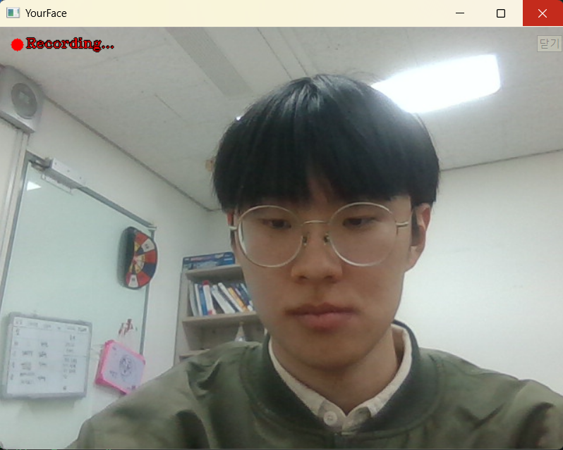
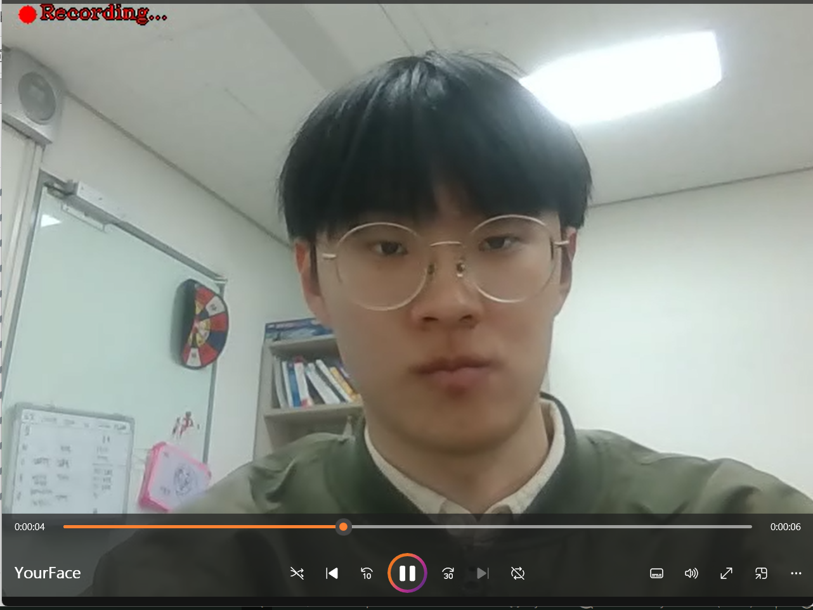
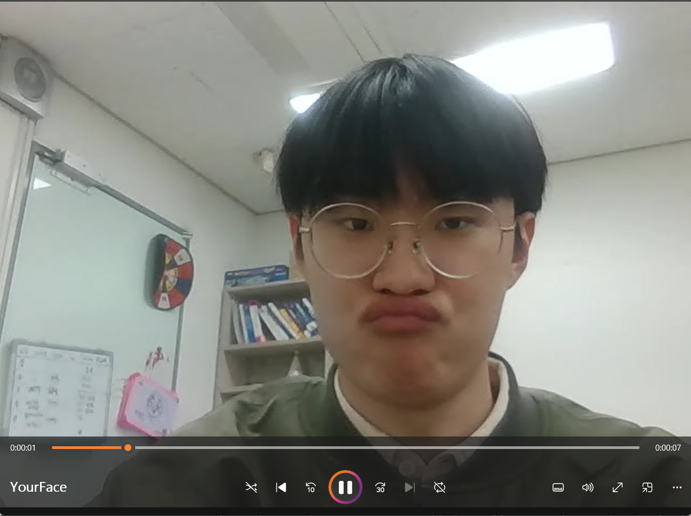
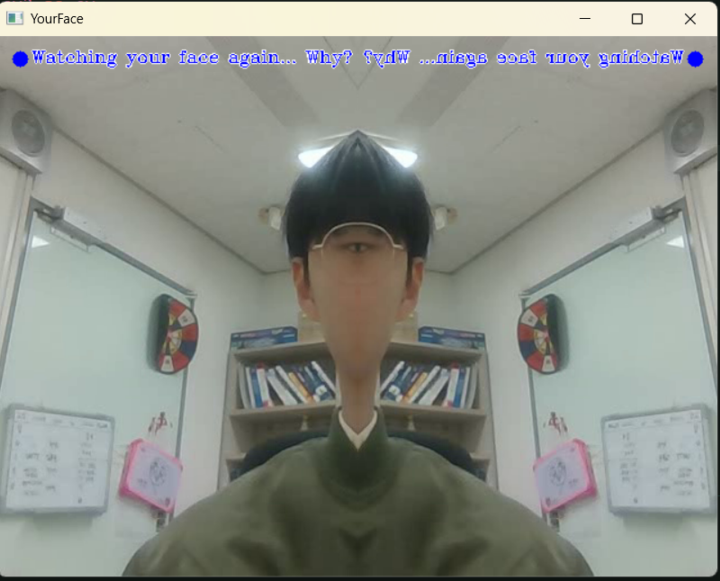
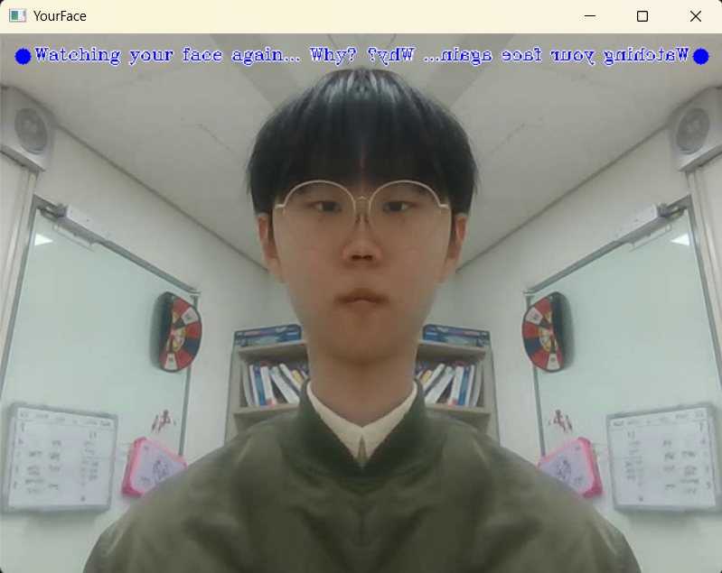
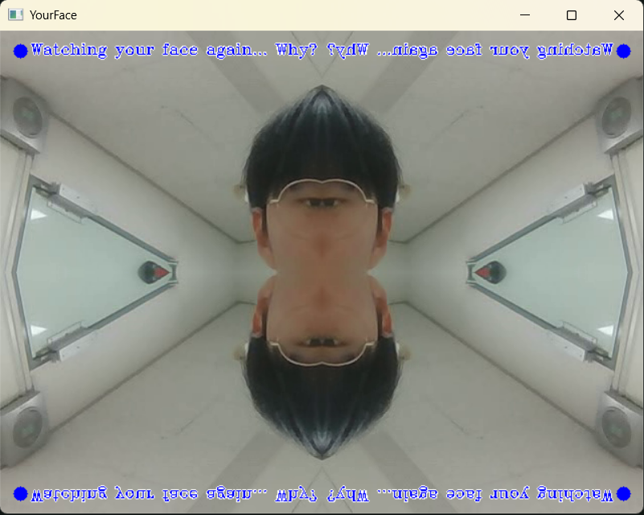

# YourFace
"니 얼굴"을 감상하세요. OpenCV로 구성된 "니 얼굴" 레코더 입니다.  
# 기능
### 1. 녹화 기능 - 멋진 "니 얼굴"을 영원히 영상으로 남기세요!
    1-1. screen change : 기록한 "니 얼굴"을 다시 돌려봐요! 리뷰 화면으로 넘어갑니다.
    | screen change : space |  

### 2. 리뷰 기능 - 뽀대나는 "니 얼굴"을 끝없이 돌려보세요!
    2-1. forward, backward - 프레임을 앞으로 넘기거나 뒤로 넘기세요!  
    | forward : = , backward : -  |
    2-2. stop - 영상을 멈춰 가장 빛나는 "니 얼굴"을 기억하세요!  
    | stop : s |  
    2-3. vertical symmetry - 환상적인 "니 얼굴"을 상하 대칭으로 감상하세요!  
    | vertical symmetry : v |  
    2-4. horizontal symmetry - 다시 봐도 멋진 "니 얼굴"을 좌우 대칭으로 감상하세요!  
    | horizontal symmetry : h |  
    2-5. screen change : 새로운 "니 얼굴"을 다시 기록해요! 다시 녹화 화면으로 넘어갑니다.  
    | screen change : space |  

# 실제 사용 예시

1.  
2.  
3.  
4.  
5.  
6. 